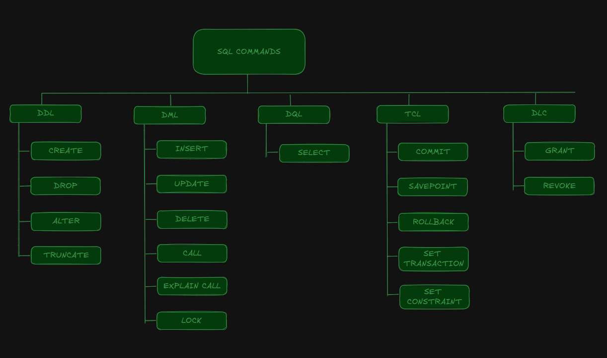

# SQL-Ejercicios-Apuntes

<p>Este repositorio contiene ejercicios y apuntes de SQL.</p>

## Estructura

El contenido se divide principalmente en tres directorios:

- **Ejercicios Repaso**: Ejercicios que he realizado por mi cuenta de diferentes webs.
- **Mis Apuntes SQL**: Apuntes con ejercicios organizados por comandos SQL, sobre una base de datos que he creado llamada *red_social* (base de datos simple).
- **SQL 1-DAM ejercicios**: Este directorio contiene ejercicios de SQL que realicé en 1º de DAM.

### SQL Commands

<div align='center'>
  
</div>

## Herramientas

- [SQL Bolt](https://sqlbolt.com/)

## 📃 License

Este proyecto está bajo la [MIT License](LICENSE.md).

## 🤝 Contribuciones

¡Gracias por tu interés en contribuir a este proyecto! Aquí te explicamos cómo puedes hacerlo:

### Clonar o Hacer Fork del Repositorio

Para comenzar a contribuir, puedes clonar o hacer un fork del repositorio. Aquí están los pasos para cada opción:

#### Clonar el Repositorio

1. **Clona el Repositorio**: Usa el siguiente comando para clonar el repositorio a tu máquina local:
   ```bash
   git clone https://github.com/Anaroncero/SQL-Ejercicios-Apuntes.git
